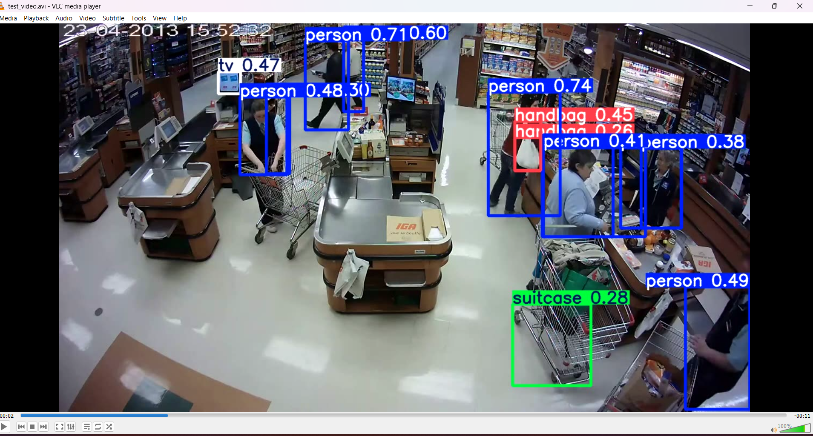

# AI-Based Threat Detection & Behavior Analysis System

## 📌 Overview

This project aims to build an AI-powered system that can analyze live video footage, detect objects held by individuals, understand human movement and behavior, and identify potential public safety threats.

The system is designed for real-world use cases such as:

- CCTV surveillance
- Public safety monitoring
- Smart city infrastructure

## 📷 Object Detection Output

## 🎯 Problem Statement

Objects like knives or stones do not always indicate criminal intent.
This project focuses on **behavior-aware AI**, which analyzes:

- Objects in hand
- Human pose and movement
- Activity patterns over time

to determine whether a situation is **safe, suspicious, or dangerous**.

## 🧠 Core Features

- Live video frame analysis
- Object detection using TensorFlow
- Human pose and movement analysis
- ANN-based behavior classification
- Feedback-based learning system
- Alert mechanism for potential threats

## 🛠️ Technology Stack

- Python
- TensorFlow / Keras
- OpenCV
- MediaPipe
- Android (CameraX)
- Flask (Backend API)

## 🗂️ Project Structure

AI-Threat-Detection-TensorFlow/
├── notebooks/ # Colab notebooks
├── data/ # Datasets & logs
├── models/ # Trained ML models
├── backend/ # Python backend scripts
├── android_app/ # Mobile application
├── milestones/ # Development milestones
└── README.md

## 🚀 Development Roadmap

- Milestone 1: Object detection (knife, stone, bag, etc.)
- Milestone 2: Human pose & movement analysis
- Milestone 3: ANN-based behavior classification
- Milestone 4: Feedback-based learning
- Milestone 5: Mobile app & CCTV integration

---

## Milestone Progress

### ✅ Milestone 1: Person Detection

- Detects all persons in the frame using YOLOv8

### ✅ Milestone 2: Pose Estimation

- Detects body keypoints and skeletons for all persons
- Enables posture and movement analysis

📷 **Sample Output:**  

### 🟡 Milestone 3: Object in Hand Detection

- Detect object near hand keypoints
- Classify potential threat vs normal activity

### 🟡 Milestone 4: Pose & Motion Feature Extraction (Next)

- Detect human pose landmarks using MediaPipe
- Visualize skeleton overlay on video frames
- Extract motion features:
  - Arm angle (posture)
  - Hand speed (movement intensity)
- Prepare features for ANN-based behavior classification

### 🟡 Milestone 5: Behavior Classification (Completed)

- ANN-based behavior prediction
- Real-time inference on video frames
- Normal / Suspicious / Dangerous classification
- Foundation for alert & feedback system

## 🎯 Output Classes

Class Meaning
0 Normal
1 Suspicious
2 Dangerous

## 📈 Status

✅ Completed
✅ Predictions visible on video
✅ End-to-end pipeline validated

### 🧩 Model File

- `behavior_ann_model.h5` — Trained ANN model used for classifying human behavior into Normal, Suspicious, and Dangerous categories.
