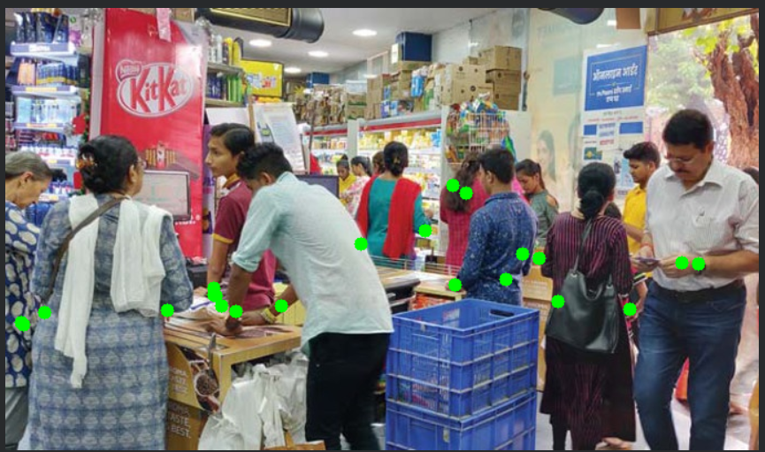

# Milestone 2 — Multi-Person Pose Estimation

## Objective

Extend person detection to understand **human posture and movement**
by detecting body keypoints and skeletons.

## What Was Implemented

- YOLOv8 Pose model (`yolov8n-pose.pt`)
- Multi-person pose detection
- 17 body keypoints per person
- Skeleton visualization using keypoint connections

## Output Example

## Why This Matters

Pose estimation is a critical step toward:

- Activity recognition
- Object-in-hand analysis
- Threat behavior detection in CCTV systems

## Status

✅ Completed and verified on multiple persons
